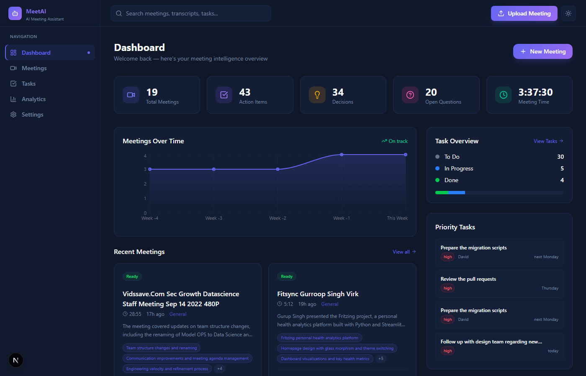
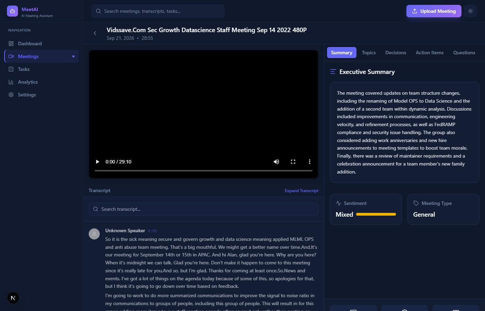
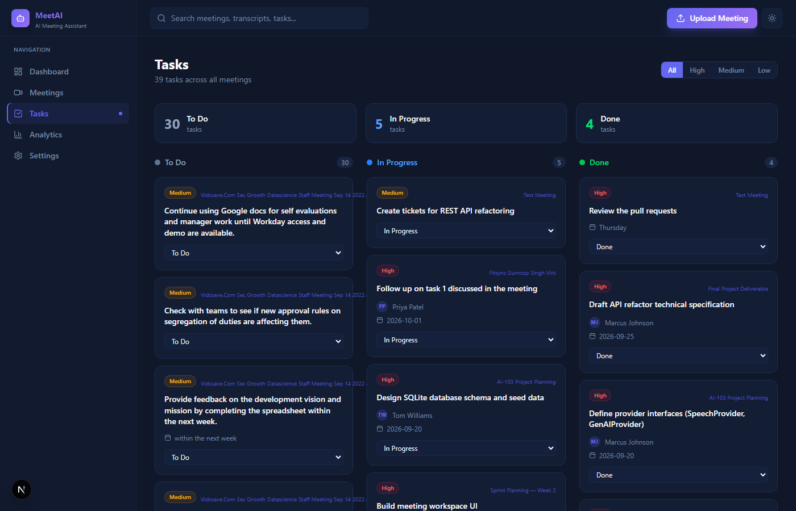
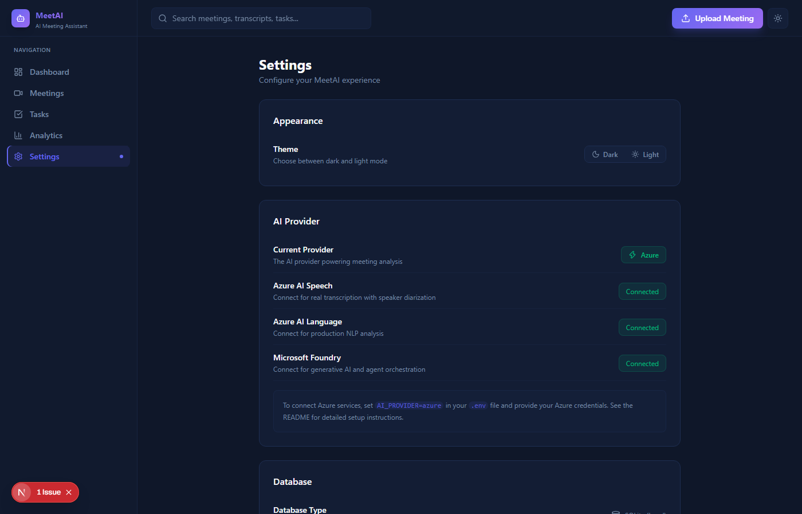

# MeetAI — Agentic AI Meeting Assistant



MeetAI is an advanced, agentic AI meeting assistant built to automate the post-meeting workflow. Utilizing the **Microsoft Azure AI ecosystem**, MeetAI transcribes video recordings, extracts actionable intelligence, identifies speakers, and allows you to "chat" with your meetings using grounded RAG (Retrieval-Augmented Generation). 

This project was built as the final capstone for **AI-103**, demonstrating real-world integration of generative AI and NLP services in a modern full-stack application.

**🔗 Live Demo:** [https://meetai-frontend.onrender.com/](https://meetai-frontend.onrender.com/)  
**📺 Video Explanation:** [Watch on YouTube](https://www.youtube.com/watch?v=tDK7J19m5bY)

---

## ✨ Key Capabilities

- **Automated Transcription & Diarization:** Upload an MP4 and get a high-quality transcript using **Azure AI Speech**.
- **Generative Meeting Intelligence:** Powered by **Microsoft Foundry (GPT-4.1-mini)** to automatically extract:
  - Comprehensive summaries
  - Key decisions & action items
  - Unresolved questions
  - Chronological meeting chapters
- **NLP Insights:** Leverages **Azure AI Language** for sentiment analysis, key phrase extraction, and meeting type classification.
- **Interactive "Ask Meeting":** A grounded RAG chat interface to ask questions directly about the meeting content with strict source citations.
- **"Catch Me Up":** A slider to see exactly what you missed if you joined the meeting late.
- **One-Click Follow-up Email:** Generates a professional follow-up email draft based on the meeting's decisions and action items.
- **Rich Dashboard & Task Kanban:** Track your meeting trends, action item completion, and priority tasks over time.

---

## 🏗️ Architecture & Data Flow

MeetAI is a decoupled full-stack application. The frontend is built with **Next.js (React)**, and the backend is driven by **FastAPI (Python)**. 

### Processing Pipeline
1. **Upload:** User uploads an MP4 video file via the Next.js UI.
2. **Audio Extraction:** FastAPI uses FFmpeg (via standard streams) to extract a 16kHz mono WAV audio track locally.
3. **Speech-to-Text:** The audio is chunked and sent to **Azure AI Speech (REST API)** for transcription.
4. **NLP Processing:** The raw transcript text is analyzed by **Azure AI Language** (Entity extraction, Key Phrases, Sentiment).
5. **Generative Analysis:** The transcript and NLP metadata are passed into **Microsoft Foundry (GPT-4.1-mini)** in a single comprehensive prompt to generate the structured JSON output containing the summary, chapters, action items, and decisions.
6. **Storage:** All data is persisted locally in SQLite (`meetai.db`) and immediately available to the frontend.



---

## 🛠️ Technology Stack

### Frontend
- **Framework:** Next.js 16 (App Router, Turbopack)
- **Styling:** Tailwind CSS, Framer Motion for animations
- **Icons:** Lucide React
- **Charts:** Recharts

### Backend
- **Framework:** FastAPI, Uvicorn
- **Database:** SQLite with SQLAlchemy ORM
- **Audio Processing:** FFmpeg
- **AI SDKs:** `openai` (for Azure Foundry), `azure-ai-textanalytics`

### AI Services
- **Microsoft Foundry:** Model `gpt-4.1-mini`
- **Azure AI Speech:** STT REST API
- **Azure AI Language:** Text Analytics SDK

---

## 📸 Screenshots

### 1. Intelligence Dashboard
Get a high-level view of your meetings, analytics, and urgent tasks.


### 2. Meeting Workspace
The core interface where you can watch the video alongside the interactive transcript, generated summary, action items, and chapters.


### 3. Task Kanban
Track generated action items assigned to you and your team.


### 4. Settings & Azure Integration
Verify the connection status of your real Azure AI pipelines.


---

## 🚀 Setup & Installation

### Prerequisites
- Node.js 18+
- Python 3.10+
- FFmpeg installed and available in your system `PATH`
- Microsoft Azure Account with AI Services configured

### 1. Clone the repository
```bash
git clone https://github.com/gurroopsingh/MeetAI-Agentic-AI-Meeting-Assistant.git
cd MeetAI-Agentic-AI-Meeting-Assistant
```

### 2. Backend Setup
```bash
cd backend
python -m venv env
source env/bin/activate  # On Windows: env\Scripts\activate
pip install -r requirements.txt
```

Create a `.env` file in the `backend/` directory based on `.env.example`:
```env
AI_PROVIDER=azure

# Microsoft Foundry
FOUNDRY_ENDPOINT=https://<your-resource>.openai.azure.com/
FOUNDRY_DEPLOYMENT=gpt-4.1-mini
FOUNDRY_API_KEY=<your_api_key>

# Azure AI Language
LANGUAGE_ENDPOINT=https://<your-resource>.cognitiveservices.azure.com/
LANGUAGE_API_KEY=<your_api_key>

# Azure Speech
SPEECH_ENDPOINT=https://<region>.stt.speech.microsoft.com/
SPEECH_API_KEY=<your_api_key>
```

Start the backend server:
```bash
python -m uvicorn main:app --port 8000
```

### 3. Frontend Setup
```bash
cd frontend
npm install
npm run dev
```
Access the application at `http://localhost:3000`.

---

## 🔒 Responsible AI & Privacy
MeetAI handles sensitive meeting transcripts. Currently, the application is configured to run locally (SQLite) ensuring your meeting metadata does not leave your local network except for the encrypted API calls to Azure AI services. 
* Note: Always ensure participants consent to recording and AI transcription.
* The Foundry system prompt is strictly instructed to ground answers *only* in the transcript to prevent hallucinations.

---

## 🎓 AI-103 Mapping
This project fulfills the requirements of the AI-103 curriculum:
1. **Generative AI Integration:** Microsoft Foundry usage for complex structured extraction and conversational Q&A.
2. **Applied NLP:** Sentiment and key-phrase extraction via Azure AI Language.
3. **Speech Services:** Audio-to-text processing via Azure AI Speech.
4. **End-to-End Application:** A fully functional, deployed-ready architecture integrating front-end, back-end, and cloud AI services.

---

## 📜 License
MIT License. Feel free to use and modify for educational purposes.
